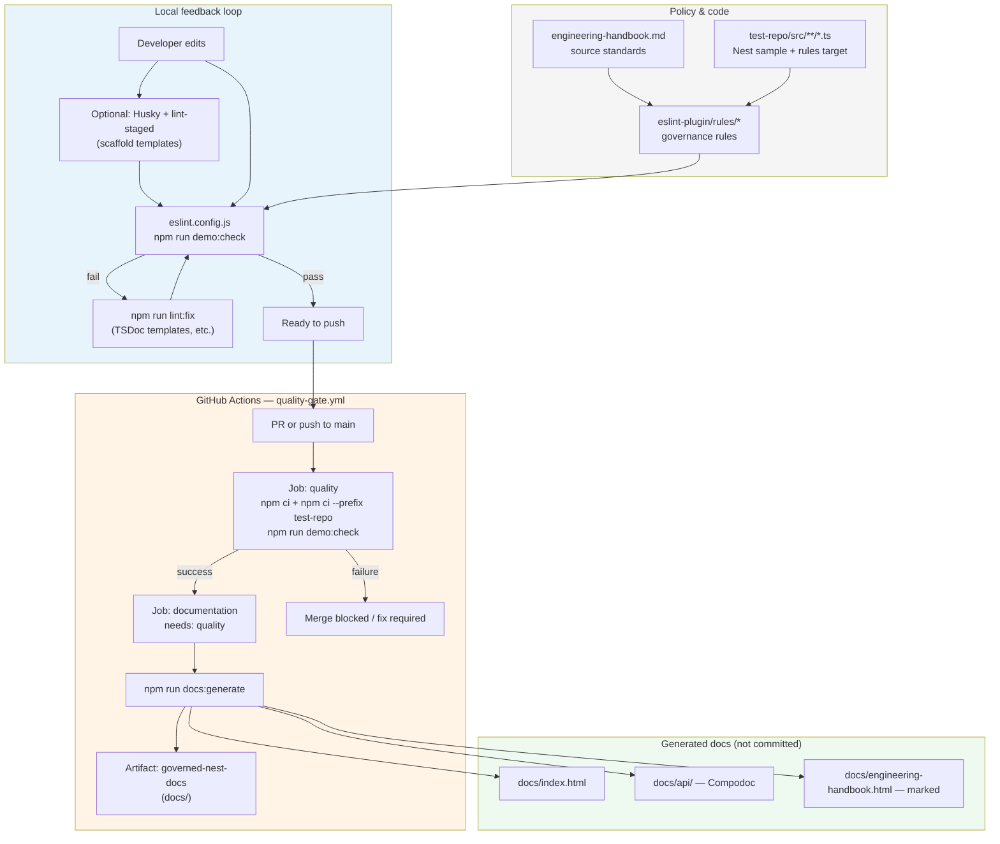

# Engineering Quality Framework — Demo Narrative

This document explains **what problem the demo solves**, **which ideas shaped the solution**, **how the end-to-end pipeline fits together**, and **which tools implement each part**. For commands and file paths, see [README.md](README.md).

---

## Problem to solve

NestJS codebases often accumulate **inconsistent naming**, **methods whose names do not match what they do**, and **thin or missing documentation**. That hurts onboarding, review quality, and generated API docs (for example Compodoc), because there is no single machine-checkable link between **written standards** and **what ships**.

This repository demonstrates a **governance toolkit** that:

- Encodes policy from an engineering handbook into **automated checks**.
- Runs those checks **locally** (fast feedback) and in **CI** (merge-time gate).
- Produces a **documentation bundle** (API docs plus handbook) only after quality passes.

The `test-repo/` directory is a governed sample application; the real product is the **rules**, **scripts**, **workflow**, and **scaffold** templates you can copy elsewhere.

---

## Concepts behind the adopted solution

| Concept | How it shows up here |
|--------|----------------------|
| **Policy as code** | Custom ESLint rules express naming, semantics, and TSDoc requirements that mirror [standards/engineering-handbook.md](standards/engineering-handbook.md). |
| **Shift-left + non-bypassable CI** | Developers run `npm run demo:check` early; GitHub Actions runs the same command on PR and `main`, so the gate cannot be skipped once branch protection is used. |
| **AST-based rules** | `@typescript-eslint/parser` feeds TypeScript-aware syntax trees; rules inspect decorators and call patterns without executing the app. |
| **Docs tied to quality** | Compodoc consumes TSDoc; the `require-tsdoc` rule pushes teams toward docs that Compodoc can actually render. |
| **Traceable artifact** | After `quality` succeeds, CI runs `docs:generate` and uploads `governed-nest-docs` so every green run has a matching handbook + API HTML bundle. |
| **Adoption via scaffold** | `scaffold/` holds Husky, lint-staged, and hook templates so another repo can adopt the same shape without reverse-engineering this tree. |

---

## Pipeline (local development through CI)

The flow has three layers: **authoring** (handbook + code), **verification** (lint and optional hooks), and **release evidence** (docs artifact). The diagram below is the canonical mental model.

**Narrative walkthrough**

1. **Standards** live in the handbook; **rules** encode checkable slices of those standards.
2. On the machine, ESLint walks `test-repo` sources and reports violations (naming, semantic mismatch, Nest suffixes, TSDoc).
3. **CI** repeats the same `demo:check` so “green on my laptop” and “green in Actions” stay aligned.
4. Only when `quality` succeeds does the **documentation** job run Compodoc (against `test-repo/tsconfig.docs.json`), copy the handbook, render Markdown to HTML with **marked**, and upload the `docs/` tree as an artifact.

---

## Tools used

| Tool | Role in this pipeline |
|------|------------------------|
| **ESLint** | Runs the custom plugin; flat config in `eslint.config.js`. |
| **@typescript-eslint/parser** | Parses TypeScript and decorators for rule logic. |
| **Compodoc** | Emits static API documentation from the governed Nest sample. |
| **marked** | Turns the handbook Markdown into `docs/engineering-handbook.html`. |
| **Node** (`scripts/generate-docs.mjs`) | Orchestrates Compodoc, copy, and HTML landing page. |
| **GitHub Actions** | `quality` then `documentation` jobs; artifact upload. |
| **Husky** / **lint-staged** | Optional pre-commit path via `scaffold/` when copied into a consumer repo. |

For a fuller table (paths and caveats), see **Tools Used in Engineering Quality Framework** in [README.md](README.md).
